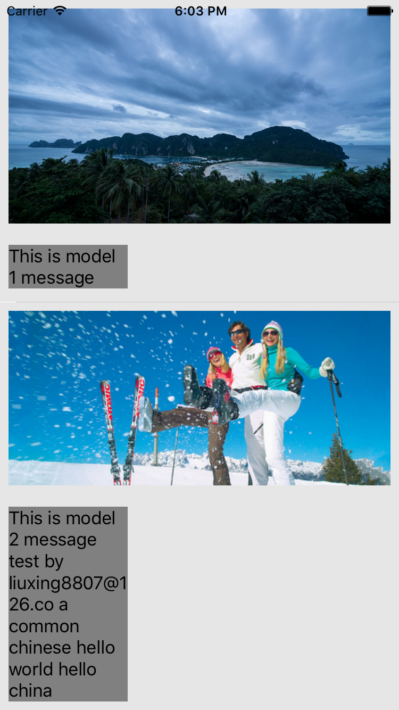

# CellAutoHeightDemo
UITableViewCell高度自动根据内容撑大Demo

###这是一个简单的Demo, 用于演示UITableViewCell高度的自适应

>需求：假设cell上要显示文本，图片等信息，cell的高度要依赖于图片，文本的高度而变化，比如对于图片来讲，在服务器返回的接口中可能并不包含图片高度，这种情况下我们就需要根据获取的图片本身的尺寸和文本内容动态改变cell的高度，我们利用Autolayout做到这些，并通过服务器返回数据后刷新指定cell

####界面展示：  
